# NovaDent - Modern Oral & Dental Health Polyclinic Web Platform

> Production-ready, clinical-grade responsive web platform designed and engineered for modern dental polyclinics and aesthetic dental centers.

---

## Developer & Commercial Contact / Geliştirici İletişim

> 🚀 **Customization, Deployment & Commercial Inquiries:**  
> If you would like to deploy this platform for your clinic, customize the design, or request bespoke healthcare software solutions:  
> 
> 💬 **Telegram:** [@luanamobile](https://t.me/luanamobile) (Direct & Fast Response)

---

## Language / Dil Seçimi
- [English Documentation](#english-documentation)
- [Türkçe Dokümantasyon](#türkçe-dokümantasyon)
- [Screenshots / Ekran Görüntüleri](#screenshots--ekran-görüntüleri)

---

# English Documentation

### Overview
NovaDent is a state-of-the-art web application crafted specifically for dental polyclinics, aesthetic dental clinics, and oral surgeons. Built with strict adherence to modern frontend engineering standards, it completely eliminates AI design clichés, oversaturated purple/neon gradients, and dummy containers. It delivers an authentic, clinical atmosphere featuring Medical Emerald & Teal tones, high-resolution photography, and high-converting patient interaction flows.

### Key Features
* **Interactive Smile Transformation Slider:** Real-time Before/After comparison tool with touch and drag physics, allowing prospective patients to visualize veneer and whitening results.
* **Smart WhatsApp Appointment System:** Auto-formats patient details, selected treatment, date, and preferred time slot into an instant WhatsApp message to the clinic.
* **Comprehensive Treatment Directory:** Filterable treatment catalog with interactive modal drawers covering Smile Design, Digital Implantology, Clear Aligners, Laser Bleaching, Endodontics, Pedodontics, and Oral Surgery.
* **Transparent 4-Step Patient Journey:** Step-by-step patient walkthrough from 3D intraoral examination to painless execution and routine follow-up.
* **Doctor Profile & Clinical Accreditation:** Clean medical authority section showcasing physician credentials, sterilization protocols (Class-B autoclave), and patient-comfort philosophies.
* **3D Technology Showcase:** Highlighting modern dental technology including 3D intraoral digital scanners and electronic painless anesthesia.
* **Responsive Mobile Experience:** Sticky quick-action bar for mobile visitors with one-tap Call, WhatsApp, and Appointment buttons.

### Tech Stack
* **UI Library:** React 19 + TypeScript
* **Build System:** Vite 6
* **Styling Framework:** Tailwind CSS v4
* **Icon Suite:** Lucide React
* **Quality & Architecture:** Zero AI-slop, WCAG AA contrast compliant, accessible focus states, optimized for Core Web Vitals.

### Source Code & Commercial Inquiries
This repository serves as a public UI/UX portfolio showcase and architectural reference. The complete production-grade source code, live deployment configuration, and custom branding services are available on inquiry:
* **Telegram:** [@luanamobile](https://t.me/luanamobile) (Fast & Direct Response)

---

# Türkçe Dokümantasyon

### Genel Bakış
NovaDent, modern diş poliklinikleri, estetik diş hekimleri ve cerrahi klinikleri için özel olarak geliştirilmiş kurumsal ve yüksek performanslı bir web platformudur. Yapay zeka tasarım klişelerinden ve mor gradyanlardan tamamen arındırılmış; medikal zümrüt, porselen beyazı ve hasta güveni oluşturan temiz tipografiyle tasarlanmıştır.

### Öne Çıkan Özellikler
* **Canlı Öncesi / Sonrası Gülüş Kaydırıcısı:** Ziyaretçilerin fare veya parmak hareketiyle sağa-sola kaydırarak zirkonyum ve beyazlatma sonuçlarını inceleyebildiği interaktif araç.
* **Akıllı WhatsApp Randevu Entegrasyonu:** Hastanın adını, ilgilendiği tedaviyi ve tercih ettiği zaman dilimini otomatik düzenleyerek tek tıkla kliniğin WhatsApp hattına ileten sistem.
* **Kapsamlı Tedavi Kataloğu:** Estetik Gülüş Tasarımı, Zirkonyum, Dijital İmplant, Şeffaf Plak, Diş Beyazlatma, Kanal Tedavisi, Çocuk Diş Sağlığı ve Çene Cerrahisi için detay pencereleri.
* **Şeffaf 4 Adımlı Tedavi Yolculuğu:** Röntgen & Muayene -> Dijital Tasarım -> Ağrısız Uygulama -> Rutin Kontrol.
* **Hekim Tanıtımı & Klinik Standartları:** Uzman hekim özgeçmişi, Class-B otoklav sterilizasyonu ve hasta dostu klinik protokolleri.
* **3D Dijital Tarama Vitrini:** Geleneksel ölçü macunlarına son veren 3D ağız içi tarayıcı ve ağrısız anestezi teknolojisi anlatımı.
* **Mobil Hızlı Erişim Çubuğu:** Mobil kullanıcılara özel ekranın altında sabitlenen tek dokunuşla "Hemen Ara", "WhatsApp" ve "Randevu Al" butonları.

### Geliştirici & Ticari İletişim
Bu platformu kendi kliniğinize uyarlamak, yeni özellikler ekletmek veya yazılım çözümleri geliştirmek için benimle iletişime geçebilirsiniz:
* **Telegram:** [@luanamobile](https://t.me/luanamobile)

---

## Screenshots / Ekran Görüntüleri

### 1. Desktop Hero & Header
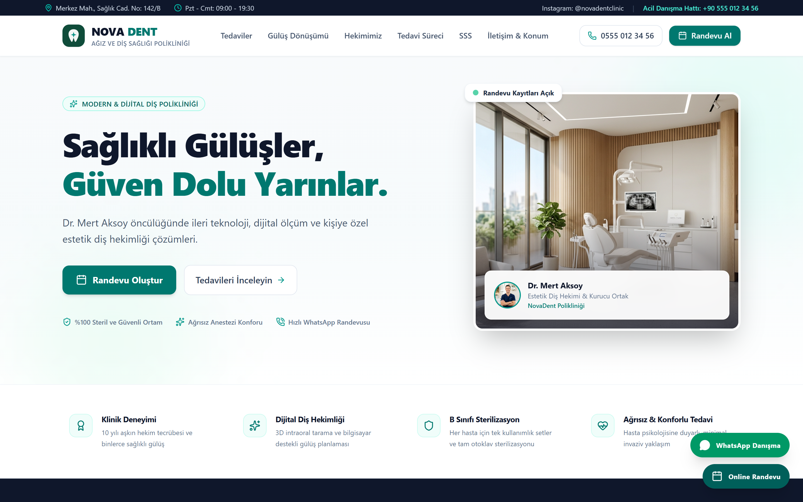

### 2. Clinical Trust & Accreditation Badges
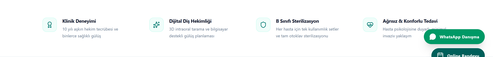

### 3. Interactive Before / After Smile Transformation Slider
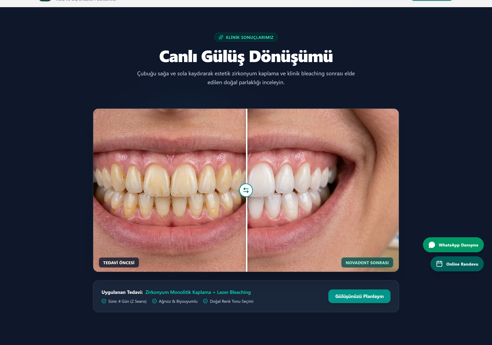

### 4. Dental Treatments Directory & Filtering
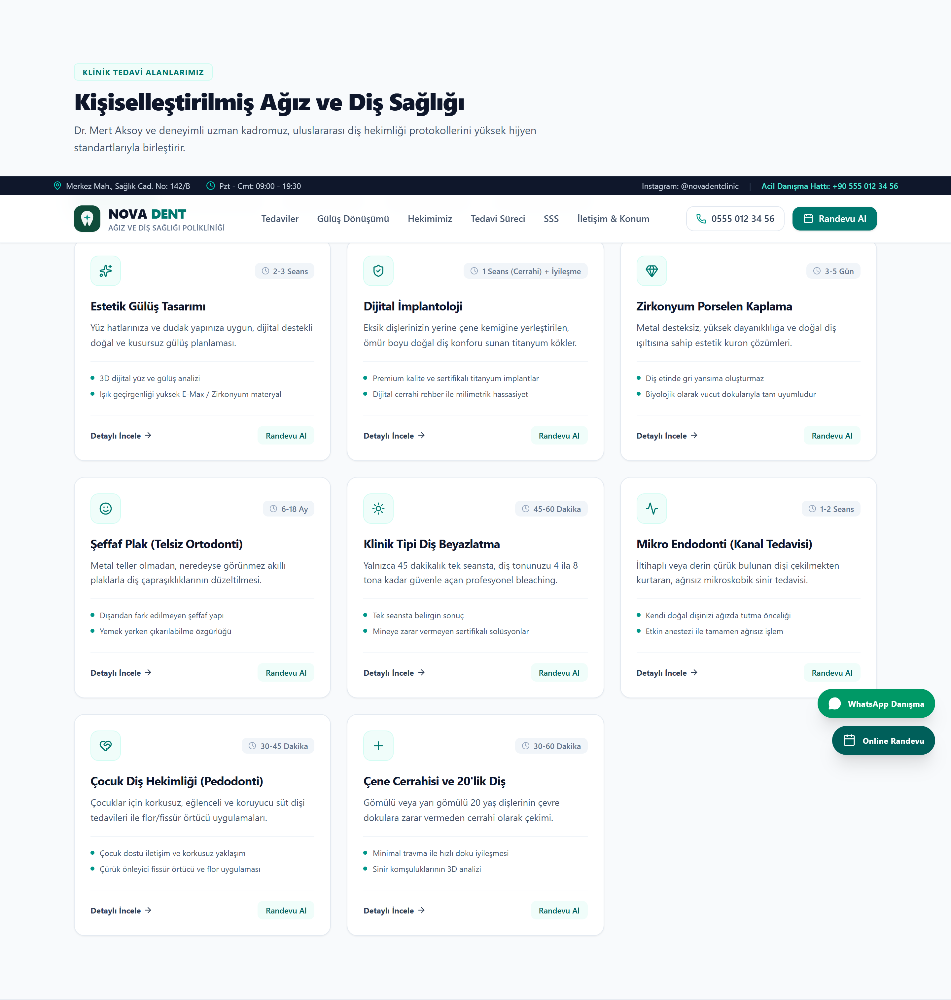

### 5. Detailed Treatment Information Modal
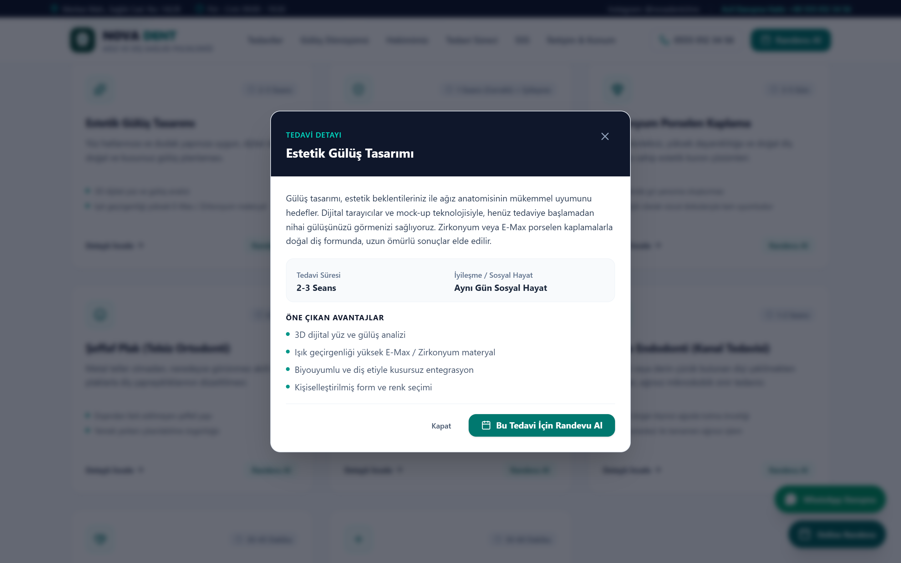

### 6. 4-Step Patient Journey
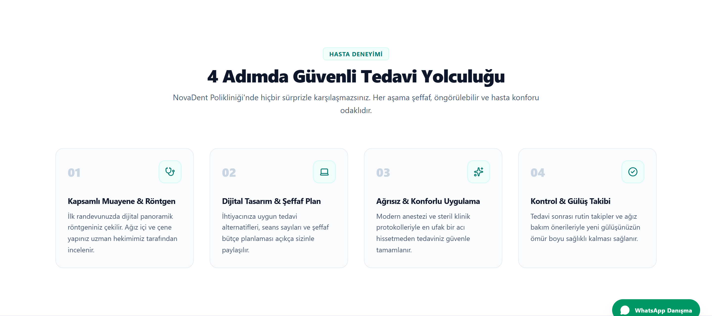

### 7. Doctor Profile & Philosophy
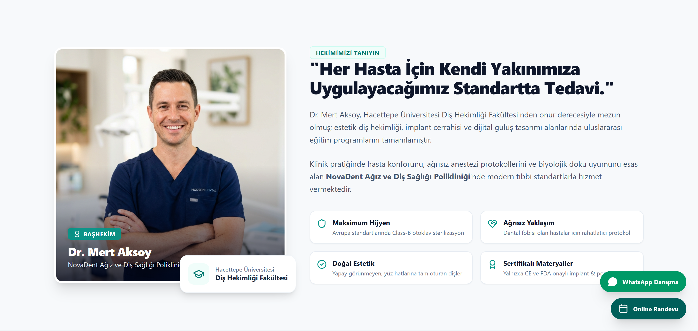

### 8. 3D Digital Intraoral Technology
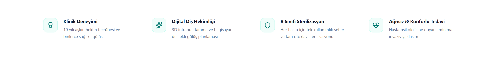

### 9. Verified Patient Reviews & Rating
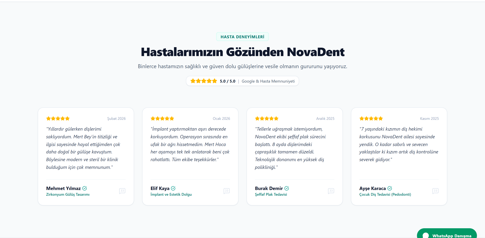

### 10. Interactive FAQ Accordion
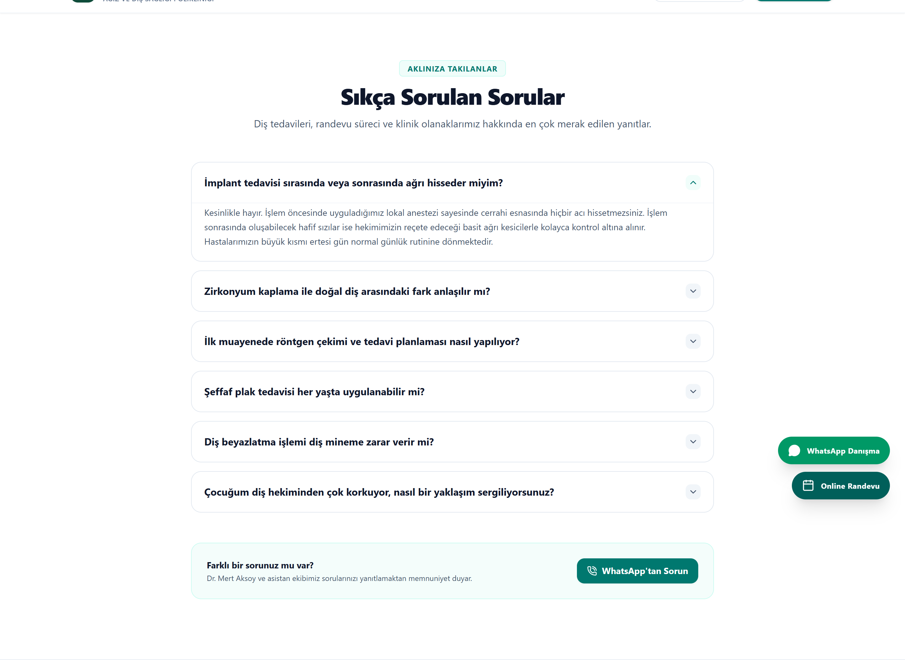

### 11. Location, Working Hours & Interactive Map
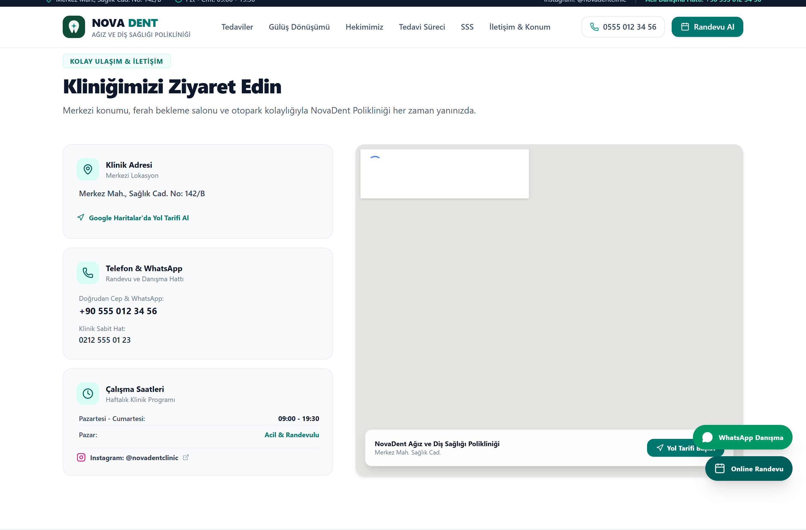

### 12. Instant WhatsApp Appointment Booking Modal
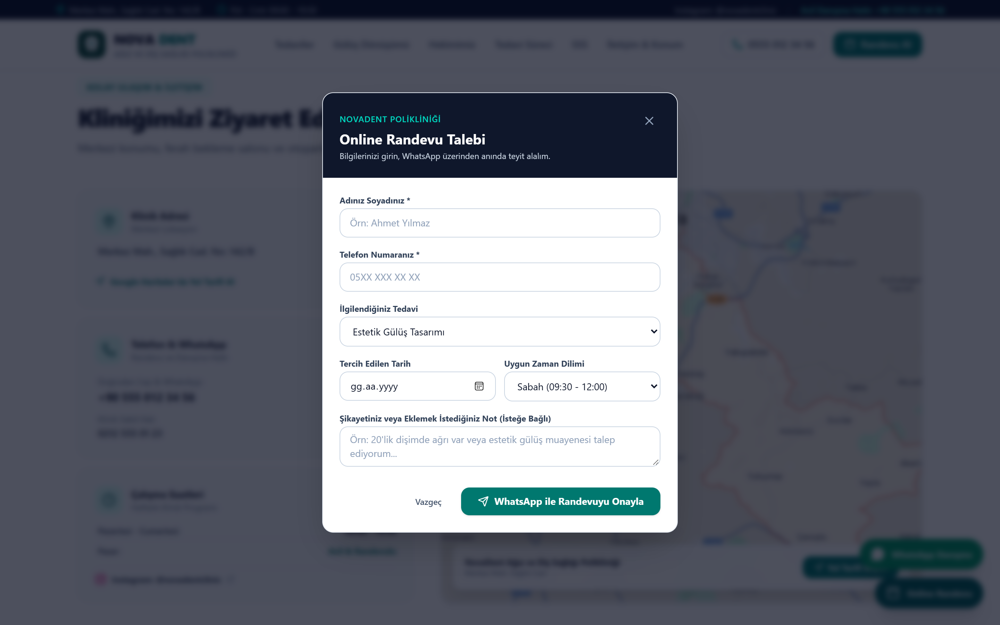

### 13. Mobile Responsive View (with Sticky Actions)

  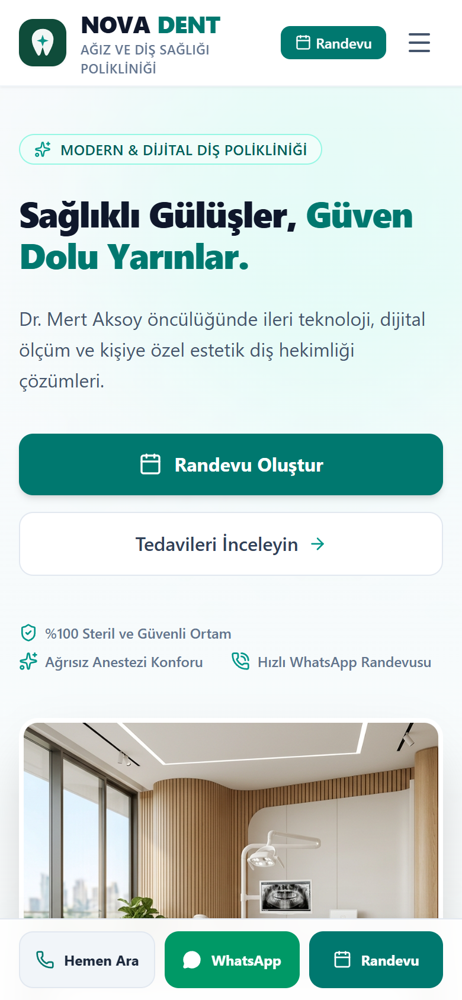

---

### Lisans & Haklar
Bu proje MIT lisansı altında dağıtılmaktadır. Geliştirici iletişimi için Telegram: [@luanamobile](https://t.me/luanamobile).
